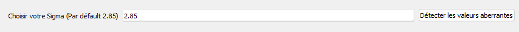
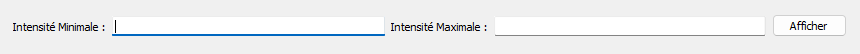

# **Empilement d’images astronomiques 🪐**

> Auteur : ELUECQUE Anthony & DOURNEL Frédéric

# **Sommaire 📃**

- 1 But du projet
- 2 Prérequis
    - 2.1 Language de programmation
        - 2.1.1 Quel language ?
        - 2.1.2 Avantages
        - 2.1.3 Inconvénients
    - 2.2 Librairies
        - 2.2.1 Astropy
        - 2.2.2 PyQt
        - 2.2.3 Matplotlib
        - 2.2.4 Numpy
        - 2.2.5 Scikit-image
        - 2.2.6 Pyinstaller
            - 2.2.6.1 Bibliothèque
            - 2.2.6.2 Compilation de notre programme
- 3 Fonctionnalités
    - 3.1 Fonctionnalités attendues :
        - 3.1 Stacking
            - 3.1.1 Stacking par moyenne
            - 3.1.2 Stacking par médiane
            - 3.1.3 Détection des outliers
    - 3.2 Fonctionnalités supplémentaires
        - 3.2.1 Détection des étoiles
        - 3.2.2 Modification de l'intensité
        - 3.2.3 Détection des maximas locaux
    - 3.3 Graphique
- 4 Comment l'utiliser ?
    - 4.1 Lancer le programme
        - 4.1.1 Avec le code
        - 4.1.2 Avec l'exécutable
    - 4.2 Utilisation de l'interface
        - 4.2.1 Ouvrir une image
        - 4.2.2 Empilement de plusieurs images
        - 4.2.3 Filtre sur une image
            - 4.2.3.1 Detection des outliers
            - 4.2.3.2 Modification de l'intensité
        - 4.2.4 Enregistrer l'image


## **1 but du projet 📌**

Le projet a pour but de réaliser une application permettant l'empilement d'images d'une même scène à partir de plusieurs prises
de vue afin d'obtenir un rendu de meilleure qualité. Ce procédé est surtout utilisé 
en astrophotographie pour permettre d'obtenir l'optimisation d'une image prise à l'aide d'un téléscope spatiale (Hubble, ...) sur des objets célestes se trouvant  à des années lumières.

## **2 Les prérequis 🛠️**

### 2.1 Language de programmation ⚙️
 
> #### 2.1.1 Quel language ? 🔠

Pour ce projet, nous avons utilisé **_Python_**. 

<sub>Python : https://www.python.org/</sub>

> #### 2.1.2 Avantages ✅

**_Python_** 
 - Dispose de nombreuses librairies pour le traitement d'image.
 - Facilite le développement de l'application par sa maniabilité.
 - Langage accessible pour de nombreux utilisateurs même neophytes.
 
> #### 2.1.3 Inconvénients ❌
 - Le programme est lent pour le traitement d'image.
 - Coût de ressources important (environ 70x supérieur aux autres languages)

### 2.2 Librairies 📚

> #### 2.2.1 Astropy 🌌

**_Astropy_** est au coeur de notre projet, cette librairie permet d'ouvrir et d'utiliser les images avec l'extension "_.fits_".

```
pip install astropy
```

<sub>Astrpy : https://www.astropy.org/</sub>

> #### 2.2.2 PyQt 🪟

**_PyQt_** est une librarie qui permet de lier le langage Python avec la bibliothèque Qt.
Celle-ci permet de créer des interfaces en proposant différents outils.

```
pip install pyQt5
```

<sub>PyQt : https://doc.qt.io/qtforpython/ </sub>

> #### 2.2.3 Matplotlib 📊

Nous avons utilisé **_Matplotlib_** pour afficher les images sur l'interface **_PyQt_** et créer les graphiques en lien avec l'image.
Nous utilisons plus particulièrement **_Matplotlib.Pyplot_**.

```
pip install matplotlib
```

<sub>Matplotlib : https://matplotlib.org/</sub>

> #### 2.2.4 Numpy

La bibliotèque **_Numpy_** nous a permis de travailler avec les données d'une image fits. 

```
pip install numpy
```

<sub>Numpy : https://numpy.org/</sub>

> #### 2.2.5 Scikit-image

**_Scikit-image_** nous a permis de réaliser les filtres sur les images. 

```
pip install scikit-image
```

<sub>Scikit-image : https://scikit-image.org//</sub>

> #### 2.2.6 Pyinstaller

### 2.2.6.1 **Bibliothèque**
Grâce à **_Pyinstaller_**, nous avons pu créer un executable (_.exe_) **(crée sous Windows)**.

```
pip install pyinstaller
```

### 2.2.6.2 **Compilation de notre programme**

Dans un terminal et en pointant le fichier, nous avons exécuté la commande suivante

```
pyinstaller --onefile mainWindow.py
```

Nous avons ainsi pu créer un fichier exécutable sous windows , utilisable sur un autre ordinateur (nous avons fait le test)

<sub>Pyinstaller : https://pyinstaller.org/</sub>


## **3 Fonctionnalités ➕**

### **3.1 Fonctionnalités attendues**


> #### 3.1.1 Stacking par moyenne

Cette méthode de stacking permet d'améliorer considérablement la netteté de l'image. 
On prend les pixels d'une même coordonnée de chaque image pour en établir la moyenne
et attribuer le résultat à une nouvelle image comme nouvelle couleur de cette coordonnée.

> #### 3.1.2 Stacking par médiane

Le stacking par médiane est une autre méthode d'empilement d'images. Nous avons constaté que celui-ci est plus pertinent que celui par moyenne.
Le rendu de l'image sera encore plus net (réduction majeur du bruit de l'image)

On fait une liste des pixels des N images sur le même point et on calcule la médiane de cette liste.
On attribut cette médiane à une nouvelle image comme couleur de ce pixel.

> #### 3.1.3 Détection des outliers

Nous avons jugé qu'il était intéressant de mettre cette détection sur un stacking, après test nous nous sommes rendus compte qu'il est très pertinent de faire cette détection
sur les deux stackings et de comparer les résultats obtenus

Cette détection se base sur les valeurs au dessus ou en dessus puis sont rejetées et remplacées par un carré blanc sur le rendu finale.
            *data < center - (sigma_lower * std)*
            *data > center + (sigma_upper * std)*


### **3.2 Fonctionnalités supplémentaires**

Fonctionnalités qui n'étaient pas attendues mais que nous avons jugé pertinent d'ajouter.

> #### 3.2.1 Detection des étoiles ⭐

La détection des corps célestes est possible dans notre application, en effet celle-ci est effectuée sur un laplace de gaussien (LoG) . 
Le gaussien permet le lissage de l'image (réduction du bruit) et le laplacien est calculé sur une image noir et blanc (détection des "blobs").
L'intérêt d'utiliser un gaussien permet de compenser la sensibilité au bruit de l'image que génère le calcul laplacien tout en augmentant la précision du résultat.

Si l'image est uniforme, alors le résultat de ce filtre sera uniforme aussi et penchera vers le noir (0).

*Le résultat peut prendre un certain temps à être calculé, comptez environ 2min pour une image monochromée*


> #### 3.2.2 Modification de l'intensité

L'intensité ici est modifiée par un input de l'utilisateur, de base celle-ci s'adapte à la range de l'image. 
L'intérêt est de mettre en surbrillance ou de cacher certaines zones de l'image.
Ces valeurs peuvent montées jusqu'à "presque" l'infini (si on peut le quantifier)

> #### 3.3 Detection des maximas locaux

Un extremum est une valeur maximale ou minimale.
Sur une image un maxima est un pixel si ce pixel est supérieur ou égal à tous ses voisins immédiats.
L'intérêt est de déterminer où se trouvent les corps célestes et les éléments qui sont en commun.
Cela permet d'ajouter un complément à la détection d'étoiles, voir à l'intensité puisque l'on peut détecter les "éléments".


### **3.3 Graphique**

Le Graphique est utilisé pour connaître le color Scaling de l'image, cela permet de connaître :
            - Si les couleurs de l'image sont sur 8 bits, 16 bits , ...
            - Les couleurs utilisées : on peut effecter un traitement sur l'image pour isoler les plages de couleurs qui nous intéressent (vmin & vmax dans l'application)

## **4 Comment l'utiliser ❔**

### 4.1 Lancer le programme ▶️

> #### 4.1.1 Avec le code 

Pour utiliser le programme à partir du code, il faut run (démarrer) le fichier **mainWindow.py** grâce à un éditeur de code comme _VS code_.

<sub>VS code : https://code.visualstudio.com</sub>

> #### 4.1.2 Avec l'exécutable

Double cliquer sur le fichier **mainWindow.exe** et l'interface s'ouvrira.

### 4.2 Utilisation de l'interface 

> #### 4.2.1 Ouvrir une image

Une fois l'interface ouverte,il suffit de cliquer sur le bouton _"ouvrir un fichier"_ et de choisir votre fichier au format _".fits"_. 
Il est aussi possible d'ouvrir plusieurs fichiers à la fois, pour cela cliquer sur "Ouvrir un dossier".
Selectionner ce dossier puis faites OK , **attention ce dossier ne doit contenir que des fichiers FITS de la même image**


> #### 4.2.2 Empilement de plusieurs images

Pour faire de l'empilement sur plusieurs images, il suffit de cliquer sur le menu déroulant _"Méthode Stacking"_ .
Choisir ensuite votre méthode de stacking entre le _stacking moyenne_ ou le _stacking médiane_.

Attention : le Stacking par médiane ne fonctionne que pour les images monochromées, sur les images RGB cela fait planter l'application (contrairement au stacking par moyenne qui fonctionne pour les 2 types d'images).


> #### 4.2.3 Filtrer une image

Pour choisir un filtre sur une image empilée, cliquer sur le nouveau menu déroulant _"Choisir un filtre"_ et choisir le filtre souhaité.


> ##### 4.2.3.1 Detection des outliers

Après avoir choisi le filtre pour détecter les outliers sur une image. 
Il est possible de régler le paramètre _"sigma"_. Pour cela, changer la valeur dans la zone de texte apparue et ensuite appuyer sur le bouton _"Détecter les valeurs aberrantes"_.
Information : Par défaut, le sigma est présenté à 2.85 (valeur la plus proche du résultat souhaité après test).



> ##### 4.2.3.2 Modification de l'intensité

Suite à la selection du filtre _"Modifier l'intensité"_, il est possible de choisir l'intensité minimale et maximale.
Il suffit de renseigner les valeurs dans les deux zones de textes qui sont apparues et de cliquer sur le bouton _"Afficher"_.
Attention : L'intensité maximale > intensité minimale.



> #### 4.2.4 Enregistrer l'image

Pour enregister votre image en format _".png"_,cliquer sur le bouton "_Enregistrer en PNG"_ et choisir l'emplaceent du futur fichier/dossier.
Cette enregistrement est indépendant des calculs, l'image calcul.png ne sert qu'à l'affichage de l'interface et permet l'exécution de certaines fonctionnalitées supplémentaires.


