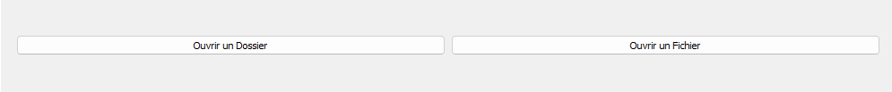
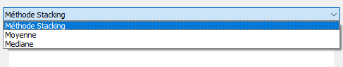
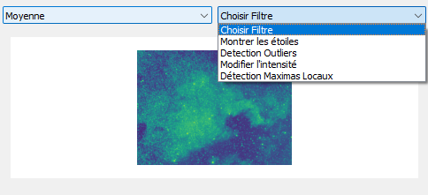
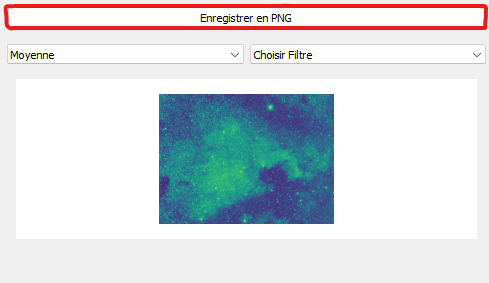

# **Empilement d’images astronomiques 🪐**

> Auteur : ELUECQUE Anthony & DOURNEL Frédéric

# **Sommaire 📃**

- 1 But du projet
- 2 Prérequis
    - 2.1 Langage de programmation
        - 2.1.1 Quel langage ?
        - 2.1.2 Avantages
        - 2.1.3 Inconvénients
    - 2.2 Librairies
        - 2.2.1 Astropy
        - 2.2.2 PyQt
        - 2.2.3 Matplotlib
        - 2.2.4 Numpy
        - 2.2.5 Scikit-image
        - 2.2.6 Pyinstaller
            2.6.1 Bibliothèque
            2.6.2 Compilation de notre programme
- 3 Fonctionnalités
    - 3.1 Fonctionnalités attendus :
        - 3.1 Stacking
            - 3.1.1 Stacking par moyenne
            - 3.1.2 Stacking par médiane
    - 3.2 Fonctionnalités supplémentaires
        - 3.2.1 Détection des étoiles
        - 3.2.2 Détection des outliers
        - 3.2.3 Modification de l'intensité
        - 3.2.4 Détection des maximas locaux
    - 3.3 Graphique
- 4 Comment l'utiliser ?
    - 4.1 Lancer le programme
        - 4.1.1 Avec le code
        - 4.1.2 Avec l'exécutable
    - 4.2 Utilisation de l'interface
        - 4.2.1 Ouvrir une image
        - 4.2.2 Stacking d'une image
        - 4.2.3 Filtre sur une image
            - 4.2.3.1 Detection des outliers
            - 4.2.3.2 Modification de l'intensité
        - 4.2.4 Enregistrer l'image


## **1 but du projet 📌**

Le but du projet est de faire un empilement d'image d'une même scène avec plusieurs prises
de vue afin qu'une image obtienne une meilleure qualité. Ce procédé est surtout utiliser 
en astrophotographie pour avoir une meilleure qualité des photos qui sont prisent à des années
lumières de distance.

Pour faire cela nous devons manipuler des images sous extensions _.FITS_ et ensuite les stacker pour améliorer
la qualité de l'image.

## **2 Les prérequis 🛠️**

### 2.1 Langage de programmation ⚙️
 
> #### 2.1.1 Quel langage ? 🔠

Pour ce projet, nous avons utilisé **_Python_**. 

<sub>Python : https://www.python.org/</sub>

> #### 2.1.2 Avantages ✅

Les avantages qu'on **_Python_** pour ce projet sont nombreux. 
 - Dispose de nombreuses librairies pour le traitement d'image.
 - Facilité de développement du fait que **_Python_** est haut niveau.
 - Langage très connu des développeurs.
 
> #### 2.1.3 Inconvénients ❌

Malheureusement, **_Python_** a également de nombreux défauts.
 - Le programme est lent pour les gros calculs
 - 

### 2.2 Librairies 📚

> #### 2.2.1 Astropy 🌌

**_Astropy_** est au coeur de notre projet, cette librairies nous permet d'ouvrir et d'utiliser les images avec l'extension "_.fits_".

```
pip install astropy
```

<sub>Astrpy : https://www.astropy.org/</sub>

> #### 2.2.2 PyQt 🪟

**_PyQt_** est un module libre qui permet de lier le langage Python avec la bibliothèque Qt.
Celle-ci permet de créer des intefaces en ayant différents outils pour cela.

```
pip install pyQt5
```

<sub>PyQt : https://doc.qt.io/qtforpython/ </sub>

> #### 2.2.3 Matplotlib 📊

Nous avons utiliser **_Matplotlib_** pour afficher les images sur l'interface **_PyQt_** et créer les graphiques en lien avec l'image.
Nous utilisons plus particulièrement **_Matplotlib.Pyplot_**.

```
pip install matplotlib
```

<sub>Matplotlib : https://matplotlib.org/</sub>

> #### 2.2.4 Numpy

La bibliotèque **_Numpy_** nous à permit de travailler avec les données d'une image fits. En effet, ces images sont composées de _"numpy.array"_  pour stocker la couleur des pixels. 

```
pip install numpy
```

<sub>Numpy : https://numpy.org/</sub>

> #### 2.2.5 Scikit-image

**_Scikit-image_** nous a permit de réaliser les filtres sur les images. 

```
pip install scikit-image
```

<sub>Scikit-image : https://scikit-image.org//</sub>

> #### 2.2.6 Pyinstaller

### 2.2.6.1 **Bibliothèque**
Grâce à **_Pyinstaller_**, nous avons pu créer un executable (_.exe_) **(crée sous Windows)**.

```
pip install pyinstaller
```

### 2.2.6.2 **Compilation de notre programme**

Dans un terminal et en pointant le fichier, nous avons exécuté la commande suivante

```
pyinstaller --onefile mainWindow.py
```

Nous avons ainsi pu crée un fichier exécutable sous windows , utilisable sur un autre ordinateur (nous avons fait le test)

<sub>Pyinstaller : https://pyinstaller.org/</sub>


## **3 Fonctionnalités ➕**

### **3.1 Fonctionnalités attendues**

Attendus dans le cahier des charges

> #### 3.1.1 Stacking par moyenne

Cette méthode de stacking permet de rendre l'image plus net. Pour faire cela on prend les pixels des toutes les images dans chaque coordonnées de l'image pour ensuite faire la moyenne de ces données et ensuite d'attribuer la moyenne comme couleur de ce pixel.

> #### 3.1.2 Stacking par médiane

Le stacking par médiane est une autre méthode d'empilement d'images. Nous avons constatés que celui-ci est plus pertinent que celui par moyenne.
Le rendu de l'image sera encore plus net (réduction majeur du bruit de l'image)

On fait une liste des pixels des N images sur le même point et on calcule la médiane de cette liste.
On attribut cette médiane à une nouvelle image comme couleur de ce pixel.

> #### 3.1.3 Détection des outliers

Nous avons jugés qu'il était intéressant de mettre cette détection sur un stacking, après test nous nous sommes rendu compte qu'il est très pertinent de faire cette détection
sur les deux stackings et de comparer les résultats obtenus

Cette détection se base sur les valeurs au dessus ou en dessus elles sont rejetés et remplacés par un carré blanc sur le rendu finale.
            *data < center - (sigma_lower * std)*
            *data > center + (sigma_upper * std)*


### **3.2 Fonctionnalités supplémentaires**

Fonctionnalités qui n'étaient pas attendu mais que nous avons jugé pertinent d'ajouter

> #### 3.2.1 Detection des étoiles ⭐

La détection des corps célestes est possible dans notre application, en effet celle-ci est effectué sur un laplace de gaussien (LoG) , le gaussien permet le lissage de l'image (réduction du bruit) et le laplacien est calculé sur une image noir et blanc (détection des "blobs").
L'intérêt ici d'utiliser un gaussien est que le calcul laplacien est très sensible au bruit de l'image , ainsi le résultat sera plus préçis.

Si l'image est uniforme, alors le résultat de ce filtre sera uniforme aussi et pencheras vers le noir (0)

*Le résultat peut prendre un certains temps à être calculé, comptez environ 2min pour une image monochromé*


> #### 3.2.2 Modification de l'intensité

L'intensité ici est modifié par un input de l'utilisateur, de base celle-ci s'adapte à la range de l'image, l'intérêt de cet ajout est de mettre en surbrillance ou de cacher certaines zones de l'image, ces valeurs peuvent montés jusqu'à "presque" l'infini (si on peut le quantifier)

> #### 3.3 Detection des maximas locaux

Un extremum est une valeur maximale ou minimale, ici sur une image un maxima est un pixel si il est supérieur à égale à tous ces voisins immédiats
L'intérêt est donc de déterminer ou se trouve les corps célestes ou les éléments qui sont en commun, cela permet donc d'ajouter un complément à la détection d'étoiles, ou bien même à l'intensité puisque l'on peut détecter les "éléments" 


### **3.3 Graphique**

Le Graphique est utilisé afin de connaître le color Scaling de l'image, cela permet de connaître :
            - Si les couleurs de l'image sont sur 8 bits, 16 bits , ...
            - Les couleurs utilisées : on peut effectés un traitement sur l'image afin d'isolé les plages de couleurs qui nous intéresse (vmin & vmax dans l'application)

## **4 Comment l'utiliser ❔**

### 4.1 Lancer le programme ▶️

> #### 4.1.1 Avec le code 

Pour utiliser le programme à partir du code, il faut run le fichier **mainWindow.py** grâce à un éditeur de code comme _VS code_.

<sub>VS code : https://code.visualstudio.com</sub>

> #### 4.1.2 Avec l'exécutable

Double clicker sur le fichier **nomDuFichier.exe** et l'interface s'ouvrira.

### 4.2 Utilisation de l'interface 

> #### 4.2.1 Ouvrir une image

Une fois dans l'interface, il vous suffit de cliquer sur le bouton _"ouvrir un fichier"_ et de choisir votre photo au format _".fits"_. Ou bien ouvrir un dossier si vous avez un dossier avec plusieurs photo à empiler.



> #### 4.2.2 Stacking d'une image

Pour faire du stacking sur une image, il vous suffit de cliquer sur le menu déroulant _"Méthode Stacking"_ et choississez ensuite votre méthode de stacking entre le _stacking moyenne_ ou le _stacking médiane_.

Attention : le Stacking par médiane ne fonctionne que pour les images monochromées, sur les images RGB cela fait plantée l'application (contrairement au stacking par moyenne qui fonctionne pour les 2 types d'images)



> #### 4.2.3 Filtrer une image

Pour choisir un filtre sur une image stackée, il vous faut cliquer sur le nouveau menu déroulant _"Choisir un filtre"_ et chossissez par la suite le filtre que vous voulez.



> ##### 4.2.3.1 Detection des outliers

> ##### 4.2.3.2 Modification de l'intensité

> #### 4.2.4 Enregistrer l'image

Pour enregister votre image en format _".png"_, il vous suffit de cliquer sur le bouton "_Enregistrer en PNG"_ ainsi que de choisir l'emplaceent du futur fichier.
Cette enregistrement est indépendant des calculs, l'image calcul.png ne sert seulement que pour l'affichage de l'interface et permettre l'exécution de certaines fonctionnalitées supplémentaires




 
